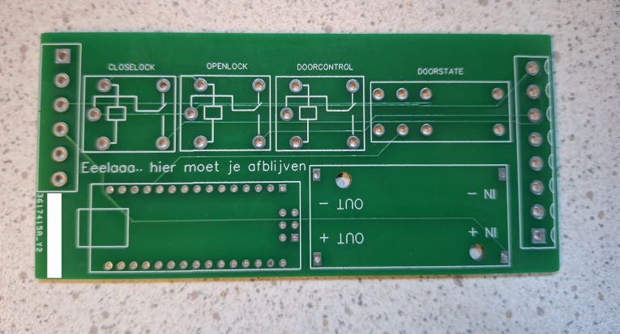

# Arduino Automatic Door Controller

Arduino sketch for controlling an automatic door with an electronic lock using two EWMini trigger inputs.

## Features
- Door opens/closes automatically based on input signals
- Lock will not engage while the door is open
- Door can be reopened mid-closing movement
- Delay between EW signal and lock signal to prevent conflicts
- Extra delay after door opens to allow lock to re-calibrate if in fault state

## Pin Overview

| Pin | Variable | Direction | Description |
|-----|----------|-----------|-------------|
| 4 | `DoorControlOut` | OUTPUT | Door motor control |
| 5 | `LockControlOpenOut` | OUTPUT | Open lock signal |
| 6 | `LockControlCloseOut` | OUTPUT | Close lock signal |
| 7 | `DoorInputAuto` | INPUT_PULLUP | Auto trigger (EWMini 2) |
| 8 | `DoorInputOC` | INPUT_PULLUP | Open/Close trigger (EWMini 1) |
| 9 | `DoorState` | INPUT_PULLUP | Door open/closed state |

## Behavior

| Auto | OC | DoorState | Action |
|------|----|-----------|--------|
| 0 | 0 | 0 | Close lock |
| 1 | 0 | 0 | Open lock → open door (stay open) |
| 0 | 1 | 0 | Open lock → open door → close door |
| 0 | 1 | 1 | Open door → close door |
| 1 | 0 | 1 | Closing: reopen — Open: close |

## To Do
- Only trigger on signal release (button held = no action, trigger fires on release)

Be carefull when playing with Electricity Kids!

